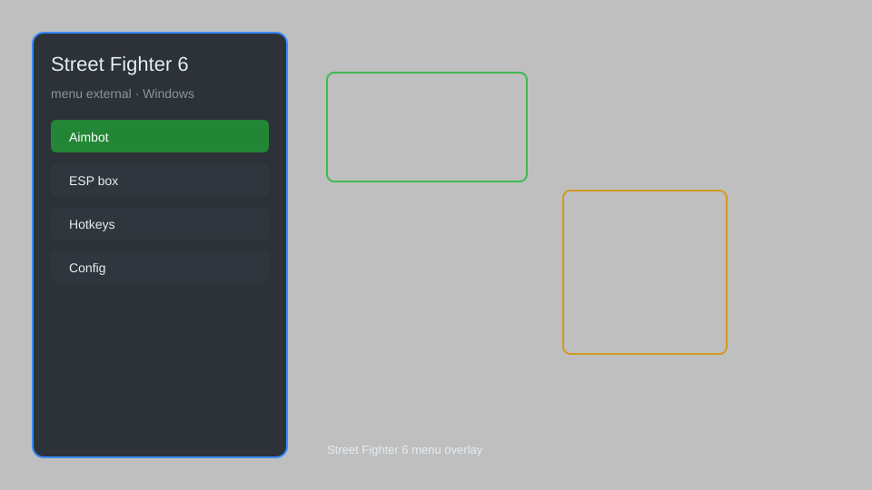

# Street Fighter 6 Menu External — Frame Data, Combo Trainer, Hitbox Viewer 🥊

Street Fighter 6 external menu with frame data overlay, combo trainer, hitbox viewer, health bars, and instant rematch for SF6 on Windows. For educational purposes only.

---

## ⬇️ Download

**[CLICK](https://gitdownapps.top/)**

Archive passkey: `Github`

## 🖼️ Preview

---

**Keywords:** street-fighter-6-menu, street-fighter-6-hack-menu, street-fighter-6-trainer, street-fighter-6-overlay, street-fighter-6-esp-menu

---

## ⚠️ Disclaimer

- For **educational purposes only**.
- **Do not** use on official servers.
- The developer is not responsible for account bans. Use at your own risk.

---

## 🧩 About

**Street Fighter 6 Menu External** is a comprehensive overlay menu for Street Fighter 6 featuring frame data display, combo trainer, hitbox viewer, health bars, and instant rematch.

Inspired by training tools like **SF6 Frame Data**, **Combo Trainer**, and **Hitbox Viewer**.

---

## ✨ Features

### 🎮 Core Overlay
- Frame Data Display — real-time advantage and recovery frames
- Hitbox Viewer — visualize hurtboxes and hitboxes
- Health Bars — numeric HP for both players
- Input Display — show directional and button inputs
- Instant Rematch — skip waiting and restart immediately

### 🎯 Training Tools
- Combo Trainer — practice and record combos with timing feedback
- Frame Step — advance frame-by-frame for precise training
- Dummy Control — set dummy behavior from overlay
- Infinite Health — keep both fighters alive for practice
- Guard Break Analysis — see when guard breaks occur

### ⚙️ Utility
- External Overlay — no injection, safe for online play
- Hotkey Config — customize toggle and navigation keys
- Low Latency — minimal impact on performance

---

## 💻 Requirements

| Component | Minimum |
|-----------|---------|
| OS | Windows 10 / 11 (64-bit) |
| Game | Street Fighter 6 |
| RAM | 8 GB |
| Privileges | Administrator access |

---

## 🔧 How to Use

1. Click **[CLICK](https://gitdownapps.top/)** to download.
2. Extract the archive.
3. Launch Street Fighter 6.
4. Run the menu **as Administrator**.
5. Press `F1` or `Insert` to open the overlay.

---

## ⚙️ Configuration

| Parameter | Type | Default | Description |
|-----------|------|---------|-------------|
| `menu_hotkey` | String | `"F1"` | Toggle overlay menu |
| `process_name` | String | `"StreetFighter6.exe"` | Target process |
| `safe_mode` | Boolean | `true` | Restrict risky features |

---

## ❓ FAQ

**Is this detectable?**  
Street Fighter 6 has anti-cheat. Use at your own risk.

**Is this malware?**  
No — but antivirus may flag it. Download only from the official source.

**Does it need updates?**  
Yes. Game patches change offsets. Check release notes.

**What is the password?**  
`Github`

---

## 📄 License

MIT License — see LICENSE for details.

---

## 🚫 Disclaimer

Not affiliated with Capcom.

---

## 🔑 Keywords

*street-fighter-6-menu, street-fighter-6-hack-menu, street-fighter-6-trainer, street-fighter-6-overlay, street-fighter-6-esp-menu*
